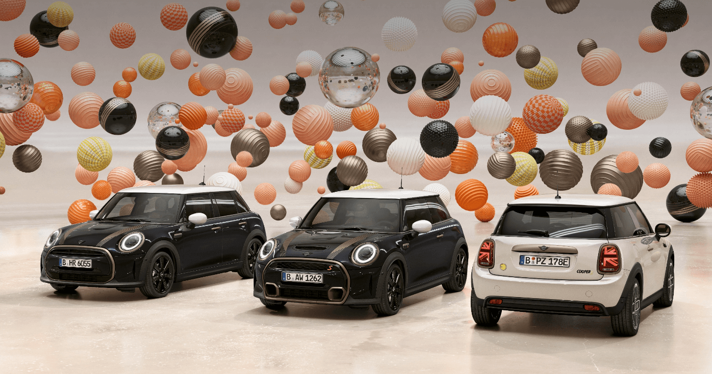

<h1 text-align="center">Mini App</h1>
Mini is a British automotive marque founded in 1969, owned by German automotive company BMW since 2000, and used by them for a range of small cars assembled in the United Kingdom, Austria and the Netherlands.

Here is a landing page of Mini where lightbox is used to fetch and pull from the database which can be found in the "scripts" folder/ "SQL" folder, by changing' fetch('data.json') ' to 'fetch('./scripts/json.php') in the box.js file

<h2>Utilizing Sass, Vue, AJAX and Fetch API</h2>
To fetch more content on the selected mini models 

<h2>Meet the Developer:</h2>
<ul>
<li>Evica Mai <a href="https://github.com/evica-ai">@evica-ai</a></li>
</ul>

<h3>Prerequisites</h3>
All you need is a browser with a working Internet connection to view our works.

<h3>Built with:</h3>
<ul>
<li><a href="https://www.w3.org/TR/2008/WD-html5-20080122/">HTML 5</a></li>
<li><a href="https://www.w3.org/Style/CSS/Overview.en.html">CSS</a></li>
<li><a href="https://developer.mozilla.org/en-US/docs/Web/CSS/CSS_Animations">CSS Animations</a></li>
<li><a href="https://www.w3schools.com/js/DEFAULT.asp">Javascript</a></li>
<li><a href="https://www.adobe.com/ca/creativecloud/buy/students.html">Adobe After Effects and Illustrator</a></li>
</ul>

<h3>Usage<h3>
Check the main branch, clone/download the project (cd to your chosen directory)

<h2>License: MIT</h2>